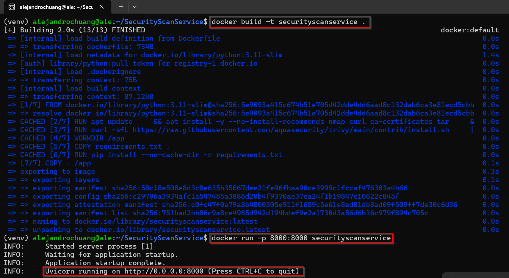
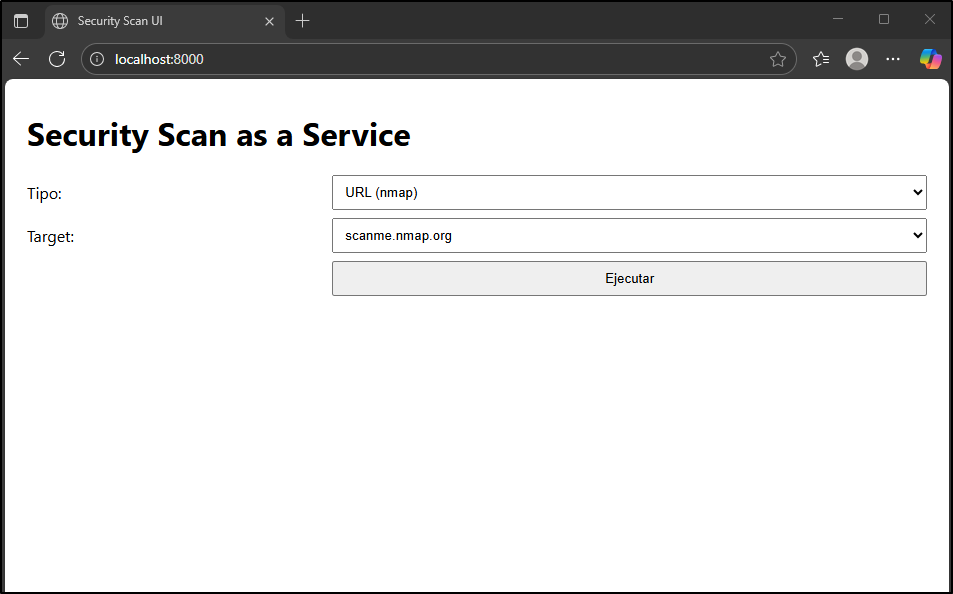
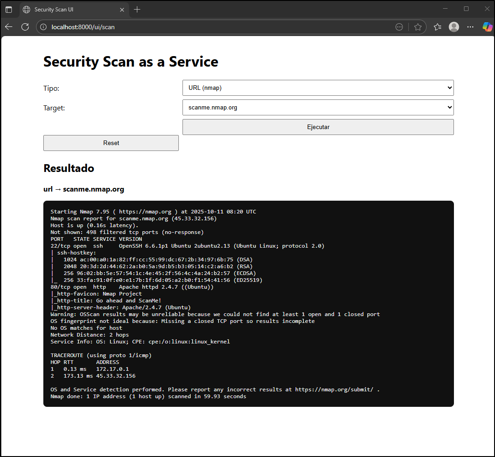

1. Security Scan as a Service

Simple app with a web UI that allows user to scan websites with Nmap or to scan Docker containers with Trivy. 

2. Features

-Web UI built with Jinjia2 templates
-backend powered by FastAPI and Uvicorn
-Supports Nmap (URL scan) and Trivy (Docker container scan)
-Timeout handling and error reporting
-Ready-to-use Docker image
-Built-in target whitelist for safety:
    -URL mode: scans only 'scanme.nmap.org'
    -Docker mode: scans only 'ubuntu:latest'     

3. Project Structure

Securityscanservice
    /app/                       #Code
        /templates/
            index.html          #UI html with Jinja2
        main.py                 #Defines endpoints for FastAPI
    /docs/                      #Screenshots from de app
    /k8s/
    /venv/                      #Local virtual environment (no versioning)
    .dockerignore               #Files that wouldn't be copied into container
    .gitignore                  #Files that Git does not keep track
    Dockerfile                  #File used to build Docker image
    README.md                   #Project documentation
    requirements.txt            #Python dependencies

4. Tech stack
-fastAPI: backend framework
-Uvicorn: ASGI server
-Jinja2: HTML templating engine
-Docker: containerization
-Nmap: security scannning tool
-Trivy: security scanning tool

5. Quick start

    a) download code from github into your working folder

    git clone https://github.com/alejandrochuang/SecurityScanService.git
    cd SecurityScanService

    b) run with Docker

    docker build -t securityscanservice .
    docker run -p 8000:8000 securityscanservice

    c) open browser at http://localhost:8000

    #NOTE: you can run locally without Docker 
    #Create and activate virtual environment
        python -m venv venv
        source venv/bin/activate
    #On Windows: venv\Scripts\activate
    #Install dependencies (FastAPI, Uvicorn, Jinja2, python-multipart)
        pip install -r requirements.txt
    #Launch app
        uvicorn app.main:app --reload

6. Endpoints

    ROUTE       METHOD      DESCRIPTION
    '/'         GET         WebUI
    '/ui/scan'  POST        Execute Nmap or Trivy scan

7. Screenshots / Demo

###Docker build image and run container

###Web UI

###Nmap result

8. Testing

Basic functional and error handling tests were performed to ensure app stability:
-Manual tests: verified that '/ui/scan' works both with URL and Docker modes via web UI
-Timeout test: confirmed scans exceeding 60s raise 'HTTPException (504)'
-Validation test: ensured valid targets are properly rejected
-Nmap execution test: verified container runs Nmap successfuly with limited flats ('--top-ports 500')

9. Dockerfile explained

-base image: python3.11-slim  #for a lightweight and secure runtime
-system packages: installs 'nmap' and 'curl' and then cleans up 'apt' cache
-Trivy: installed from official Aqua Security script
-Python dependencies: installed from 'requirements.txt' with '--no-cache-dir' to reduce image size
-final command_ runs 'uvicorn app.main:app' on port 8000

10. Key Design decisions

-Used 'FastAPI' for clarity and async performance
-Simple UI built with 'Jinja2' instead of a separate frontend framework
-Timeout added for 'subprocess.run' to prevent hanging scans
-Docker chosen for reproducible and isolated execution
-Restricted scan targets in the web interface to fixed whitelist:
    -prevents arbitrary input and command injection
    -keeps initial version safe and predictable for local testing
-Nmap scan limited
    nmap -sT --top-ports 500 -Pn -T4 --max-retries 1 -A --host-timeout 45s target

    -sT -> TCP connect scan (no need of raw sockets)
    --top-ports 500 -> scan only top 500 most common ports
    -Pn -> no ping or discovery (assumes host is up)
    -T4 -> more aggressive scan
    --max-retries 1 -> limiting retries
    -A -> aggressive: OS detectoin, version, scripts
    --host-timeout 45s -> host abort if more than 45s scan

11. Basic Security Measures

-Whitelisted scan targets (prevent arbitrary command injection)
-Enforced execution timeout and handled exceptions
-Avoided storing scan results or secrets in plain text

12. Future improvements

-allow custom targets with proper validations and sandboxing
-add CI/CD pipeline with GitHub Actions
-integrate security scans with Trivy and Bandit
-deployment with Kubernetes and configure CronJob for daily scans
-AWS Integration: store scan results in s3 bucket or dastabaes
-add user authentication

13. License